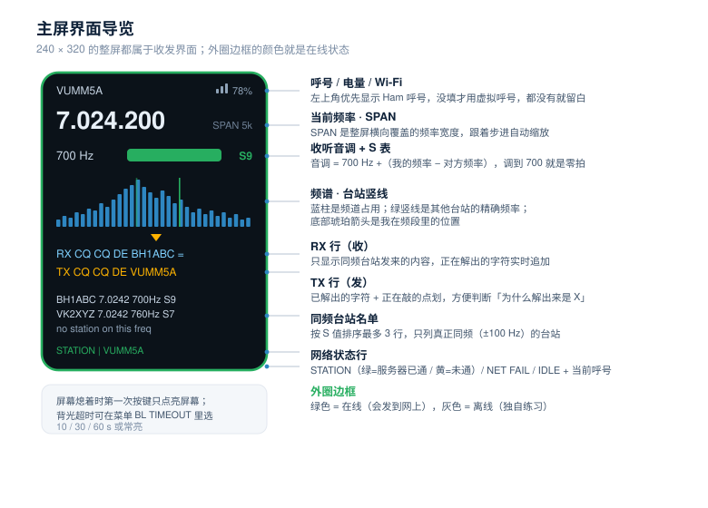
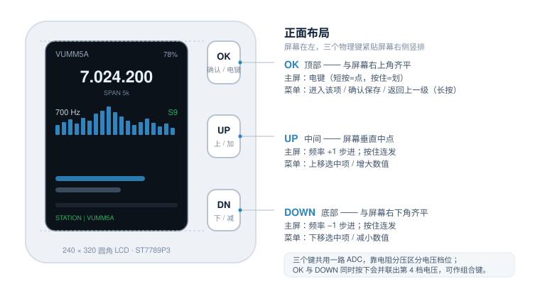
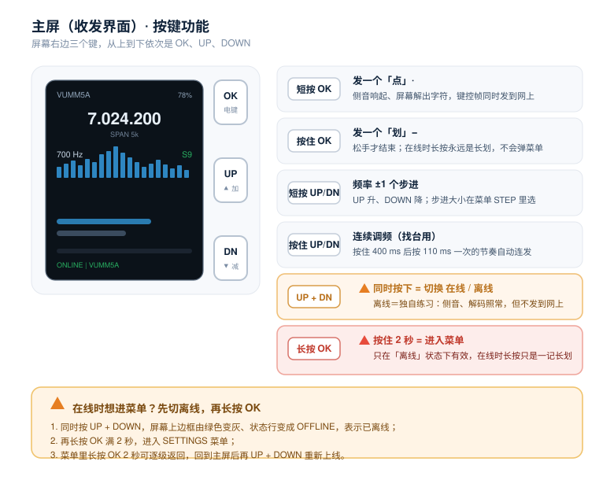
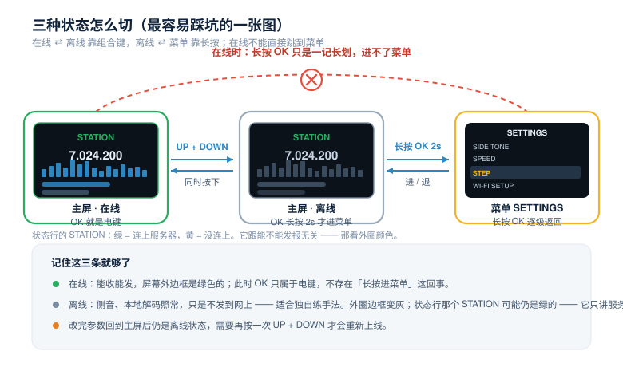
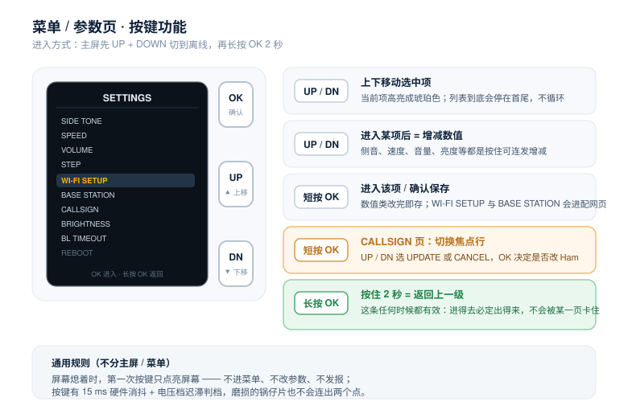
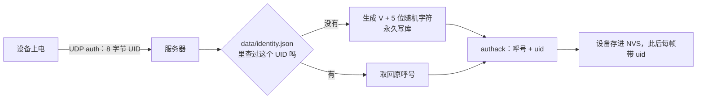
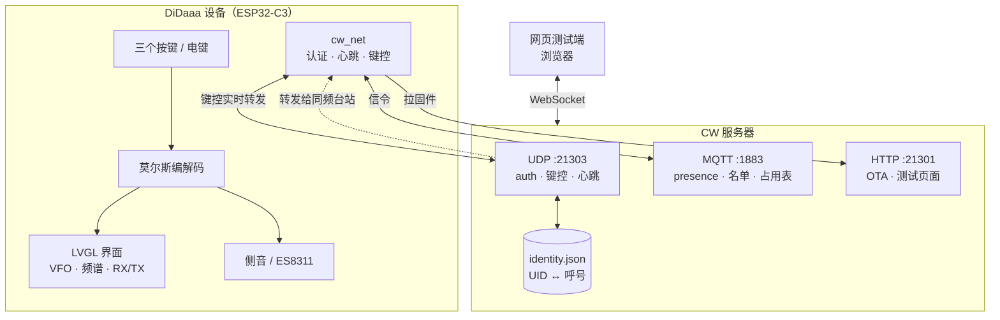

# DiDaaa

<p align="center">
  <b>把 CW 通联搬到互联网上 —— 一台真实的摩尔斯电码电台，只是"天空"换成了 Wi-Fi</b>
</p>

<p align="center">
  
  
  
  
  
</p>

> English TL;DR — DiDaaa is an internet-linked Morse (CW) rig: a palm-sized ESP32-C3
> transceiver that keys real Morse over Wi-Fi to a server, which forwards your keying to
> everyone else parked on the same virtual frequency. It keeps the things that make CW feel
> like CW: sidetone, zero-beat tuning, RST-style S-meter, and the rule that **you only hear
> stations on your own frequency**.

项目名 **DiDaaa** 取自 CW 里对短音（点）和长音（划）的拟声读法 **di-dah**。

---

## 这是什么

真实的业余无线电 CW 通联需要电台、天线、传播条件，以及一张操作证书。DiDaaa 把其中「操作的那部分手感」完整保留下来，把「无线电波」替换成 Wi-Fi：

- **你敲的还是一台电键。** 短按是点、按住是划，边发边听到侧音，屏幕上同步解出你正在发的字符。
- **对方的信号同样要"调"才能找到。** 你得把自己的虚拟频率拧到跟对方一致，错开一点点音调就偏、信号就弱 —— 而不是像聊天软件那样"总能收到"。
- **只有同频才听得到。** 这是本项目的核心规则，见[通联规则](#通联规则)。

它不是一个聊天群里的摩尔斯表情符号，而是一台有 VFO、有频谱、有 S 表、有呼号的电台。

<p align="center">
  
</p>

<!-- 
```
       ┌──────────────────────────┐
       │  DiDaaa · 7.024.200      │  ← 你的频率（40 m 虚拟频段）
       │  700 Hz  ████████░░  S9  │  ← 零拍音调 + 信号强度
       │  ▁▂▃▅▂▁ ▃▅█▅▃ ▂▁▃▅▂▁▃    │  ← 频谱（跟随步进自动缩放）
       │  RX  CQ CQ DE BH1ABC     │  ← 对方发来的、正在解码的内容
       │  TX  CQ CQ DE VUMM5A     │  ← 你正在发的
       └──────────────────────────┘
``` -->

---

## 特性一览

| | 功能 | 说明 |
|---|---|---|
| 📻 | **虚拟 VFO** | 7.000–7.200 MHz，步进 10 Hz / 100 Hz / 1 kHz / 10 kHz |
| 📈 | **频谱 + 台站竖线** | 40 根柱子显示频道占用，窗口宽度跟着步进自动切换（1k / 5k / 50k / 200k） |
| 🎧 | **零拍调谐** | 音调 = 700 Hz +（我的频率 − 对方频率），调到 700 Hz 就是完美零拍 |
| 📶 | **S 表** | 失谐越大 S 越小，零拍时满格 S9 |
| ⌨️ | **真电键手感** | 按键按下/抬起两个边沿测时长判点划，10–30 WPM 自适应 |
| 🔤 | **双向解码** | 收发两侧各自实时解出字符，显示在 RX / TX 行 |
| 🪪 | **双呼号体系** | 你的真实呼号（Ham）+ 服务器按硬件唯一 ID 下发的虚拟呼号（Virtual） |
| 🔐 | **硬件身份认证** | 出厂 MAC 的 48 位作为 Global UID，服务器据此永久绑定呼号 |
| 📡 | **UDP 实时键控** | 键控帧不做存储转发，收到即转，端到端只有一跳 |
| 🌐 | **MQTT 信令** | 在线名单、presence / LWT 遗嘱、频道占用表走 MQTT |
| 🔼 | **OTA 空中升级** | 双槽分区 + 回滚确认，菜单里一键升到服务器上的最新版 |
| 💡 | **侧音 / 音量 / 背光** | 侧音 300–1200 Hz 可调、音量 0–100、背光超时 10/30/60 s 或常亮 |

---

## 硬件

本项目跑在 **FoloToy AI Passport** 这块 ESP32-C3 开发板上。换板也能跑，但要满足这几条：

| 部件 | 规格 | 备注 |
|---|---|---|
| SoC | ESP32-C3（RISC-V，无 FPU） | 8 MB Flash，双槽 OTA 布局 |
| 显示屏 | ST7789P3，240 × 320 圆角 | SPI，LVGL 9 驱动 |
| 音频 | ES8311 编解码器 | I2S + I2C，I2S ISR 需 IRAM 安全 |
| 按键 | 3 个物理键，共用一个 ADC 引脚 | 靠电阻分压区分；**下 + 确定** 并联出第 4 档电压，可作为组合键 |
| 串口 | USB Serial-JTAG | GPIO18/19，不用 UART0（TX 与背光引脚冲突） |

三个键在固件里叫 **UP / DOWN / OK**，位于屏幕右侧竖排：**OK 与屏幕右上角齐平、UP 居中、DOWN 与屏幕右下角齐平**。如何操作见下一节。

<p align="center">
  
</p>

---

## 按键怎么用

三个键承担了**发报、调频、菜单导航、联网开关**四件事。规则不多，但有两条容易踩，请先看「⚠️」那两行。

<p align="center">
  
</p>

### 主屏（收发界面）

| 操作 | 效果 |
|---|---|
| **按 OK** | 就是电键。短按 = 点（·），按住 = 划（−），松手结束。同时响侧音、出字符、往网上发键控帧 |
| **短按 UP / DOWN** | 频率 ±1 个步进（方向跟旋钮一致：UP 升高） |
| **按住 UP / DOWN** | 连发：400 ms 后按 110 ms 一次的节奏连续调频，找台用 |
| **同时按 UP + DOWN** | 切换 **在线 / 离线**。离线即"独自练习"：侧音和本地解码照样走，但不发到网上 |
| **长按 OK 2 秒** | 进入菜单 —— **⚠️ 只在离线状态有效**（见下方说明） |

> ⚠️ **为什么在线时长按 OK 不进菜单？**
> 在线时 OK 就是电键，**长按只能是一记长划**。如果照样弹进菜单，你发个 `T`（单划）或 `M`（双划）就会被打断，而且服务端会收不到 keyup，别人家的喇叭留一条永不结束的长音。
> 所以在线时要进菜单，请**先同时按 UP + DOWN 切到离线**，再长按 OK。

<p align="center">
  
</p>


#### SPAN5K 说明

关于频谱那一行 **`SPAN 5k`**：它是整屏横向覆盖的频率宽度，跟着步进自动缩 —— 步进越小看得越细。按一下 UP 在屏幕上的位移始终保持在 2～11 px，不会出现"按了没反应"或"一按飞出屏"。

| STEP | SPAN | 每像素代表 | 按一下大约移动 |
|---|---|---|---|
| 10 kHz | 200 kHz | 880 Hz | 11 px |
| 1 kHz | 50 kHz | 220 Hz | 11 px |
| 100 Hz | **5 kHz** | 22 Hz | 4.5 px |
| 10 Hz | 1 kHz | 4.4 Hz | 2.3 px |


### 菜单 / 参数页

<p align="center">
  
</p>

#### 菜单树

```
SETTINGS
├─ SIDE TONE        侧音频率 300–1200 Hz
├─ SPEED            发报速度 10–30 WPM（决定点划时长）
├─ VOLUME           音量 0–100
├─ STEP             VFO 步进 10 / 100 / 1k / 10k
├─ WI-FI SETUP      重新配网（SoftAP 页面）
├─ BASE STATION     改服务器地址（只改这一项，Wi-Fi 不动）
├─ CALLSIGN         查看 Ham / Virtual 双呼号；更新 Ham
├─ BRIGHTNESS       背光亮度
├─ BL TIMEOUT       背光超时 10 / 30 / 60 s / 常亮
├─ REBOOT           重启
├─ FACTORY RESET    清空 NVS 里的凭据与设置
├─ UPDATE           联网检查固件并 OTA
└─ ABOUT ME         设备 ID / 固件版本 / MAC
```


| 操作 | 效果 |
|---|---|
| **UP / DOWN** | 上下移动选中项；进入某一项后则是增减数值 |
| **短按 OK** | 进入该项 / 确认保存并返回菜单 |
| **长按 OK 2 秒** | 返回上一级（这条**任何时候都有效**，进得去必定出得来） |

### 通用

- **屏幕熄着时第一次按键只点亮屏幕**，不进菜单、不改参数、不发报。摸黑按一下本意是"看清屏幕"，顺手把 REBOOT 触发了代价太大。
- **按键抖动不用担心**：15 ms 硬件消抖 + 电压档迟滞判档，磨损的锅仔片也不会连出两个点。


---


## 通联规则

这部分是 DiDaaa 的灵魂 —— 它决定了"像不像真的在开电台"。

### 只有同频才互相收得到

两台设备的虚拟频率**相差不超过 ±100 Hz** 才算在同一个频道上。服务端据此决定是否转发，设备端据此决定是否让信号进 RX —— 三处容差必须一致：

| 位置 | 常量 |
|---|---|
| 服务端 `server.js` | `CHANNEL_TOL`（可用环境变量 `CW_TOL` 覆盖） |
| 固件 `cw_net.c` | `CW_CHANNEL_TOL_HZ` |
| 固件 `cw_radio.c` | `CW_CHAN_TOL_HZ` |

> 改一处不改另外两处，就会出现"服务端转发了但设备端把它丢了"这种半边生效的怪事。

### 零拍：为什么调到 700 Hz 最好

听到的音调 = **700 Hz +（我的频率 − 对方频率）**。

```
对方在 7.024.200 ───────────────────→ 我们的频率

7.023.900   音调 400 Hz   掉出通带，听不见
7.024.100   音调 600 Hz   听得见，偏低
7.024.200   音调 700 Hz   ★ 零拍 · S9 · 跟自己的侧音一样
7.024.300   音调 800 Hz   听得见，偏高
7.024.600   音调 1100 Hz  掉出通带，听不见
```

**S 值**由失谐量算出：`S = 9 − |音调 − 700| / 90`。零拍满格，偏 90 Hz 掉一格。

这和真机上的操作是一致的：找到信号后细调 VFO，让音调降到跟自己侧音一样 —— 老手管这叫"zero beat"。

### 其他规则

- **发送者不自收**：服务器不把你自己的键控回传给你。
- **同频可多发**：同一频率允许多台同时发报，服务器不仲裁、不阻断（跟真机上撞车一个道理）。
- **实时转发**：键控帧收到即转，不落库。
- **TX / RX 状态**：开始发送即进入 TX，停止发送回到 RX。
- **调频立即生效**：你改了频率，服务器立即更新，之后只收新频率上的信号。
- **断线保护**：keydown 之后超过一定时长没有 keyup（UDP 帧丢了），收发两端都会强制闭音，避免喇叭长鸣。

---

## 身份与呼号

### 两种呼号

| | 谁来决定 | 能不能改 | 用在哪 |
|---|---|---|---|
| **Ham** | 你，在配网页面填 | ✅ 菜单 CALLSIGN → UPDATE | 显示在主屏左上角（你自己的样子） |
| **Virtual** | 服务器按 Global UID 下发 | ❌ 永久绑定 | 别人名单里看到的那一个 |

没填 Ham 就什么都不显示（不拿 MAC 凑一个假的），不用怀疑屏幕上为什么是空的。

### Global UID 与永久绑定

每台机器有一个唯一身份 **Global UID = 出厂 MAC 的 48 位**（也就是设备 ID，两者是同一个东西，不存在两个 ID）。



- 呼号形如 `V3KQ9Z`：首位固定 `V`，其余 5 位取 `0-9A-Z` 共 36 个字符。
- **一个 UID 永远对应同一个呼号**，服务器重启、重装、换网络都不会变。
- 认证通过之前：不连 MQTT、不进在线名单、不允许发报。
- 呼号与 UID 的绑定表落在服务端的 `data/identity.json`，是**唯一不可再生的数据** —— 丢了全员换号。

> 屏幕、协议两处的呼号优先顺序是**故意反过来的**：屏幕上显示 Ham → Virtual（你想看见自己的号），而 hello 帧和 presence 主题必须报 Virtual → Ham（服务端只认它自己发的那个号）。

---

## 系统架构



三条通路各司其职：

| 通路 | 承载 | 为什么用它 |
|---|---|---|
| **UDP 21303** | 认证、心跳、键控帧 | 键控要低延迟、要容忍丢包，不能套 TCP 的重传逻辑 |
| **MQTT 1883** | presence（含 LWT 遗嘱）、在线名单、频道占用表 | 有状态但不实时，发布订阅模型天然适合"谁在线"这类广播 |
| **HTTP 21301** | `/fw/version` + `/fw/cw.bin` | OTA 走成熟可靠的 HTTP 下载，Range 请求天然支持断点续传 |

UDP 帧统一 16 字节定长：`CW` 魔数 + 类型 + 载荷（详见 `main/cw_proto.h`）。

| 类型 | 方向 | 用途 |
|---|---|---|
| 1 `key` | 双向 | 键控：通/断 + 序号 + 频率 + 发送速度 + 设备毫秒时钟 |
| 2 `hello` / `ack` | 双向 | 注册、呼号、频段边界 |
| 3 `occupy` | 下行 | 频道占用表（每格 2 kHz 的台站数） |
| 4 `heartbeat` | 上行 | 在线 + 当前频率（也是规则 12 的载体） |
| 5 `auth` / 6 `authack` | 双向 | Global UID 认证与虚拟呼号下发 |

---

## 快速开始

### 1. 编译烧录

环境：ESP-IDF **5.5.3**，`IDF_TARGET=esp32c3`。

```bash
# 拉依赖（dependencies.lock 已锁定版本，组件管理器会自动下载）
idf.py reconfigure
idf.py build flash monitor
```

懒人方式：

```bash
./tools/onekey.sh            # 只编译
./tools/onekey.sh -p         # 编译 + 自动抬版本号 + 发布固件（OTA 用）
./tools/onekey.sh -f         # 编译 + 串口烧录
```

或者**双击根目录的 `一键编译.command`**（macOS），弹菜单选一项回车即可。

> Windows / Linux 也一样用 `tools/onekey.sh`。
> ⚠️ 每次编译前脚本会清掉 `build/log` —— idf.py 自己会在成功那次创建这个目录，留着会让下一次构建以 `PermissionError: EEXIST` 失败。这不是脚本多事，是替它收拾。

### 2. 配网

首次上电没有 Wi-Fi 凭据，自动进入配网模式：

1. 手机/电脑连上屏幕显示的热点（名字带 AP 后缀，屏幕上有随机密码）
2. 浏览器打开屏幕上的地址
3. 填 Wi-Fi、服务器地址、你的 Ham 呼号 → 保存，设备重启联网

之后要改可以在菜单里操作：`WI-FI SETUP` 全套重配，`BASE STATION` 只改服务器地址，`CALLSIGN` 只改呼号。

### 3. 起服务端

服务端**不在本仓库**（见[服务端仓库](#服务端仓库)）。最小可用要求：Node 18+，零第三方依赖。

```bash
node server.js                    # 起 21301/tcp + 21303/udp + 1883/tcp
curl localhost:21301/who           # 看谁在线
```

### 4. 通联

两台设备调到同一个频率（比如都停在默认的 7.024.200），按 OK 发报。对方听到 700 Hz 的零拍音调，屏幕上 RX 行同步解出字符。

想多一点热闹，服务端里内置了几个演示台站，会定时在各频率上发 CQ —— 一开机就有了"波段里有人在"的感觉。

### 5. 公网部署（自己的域名）

要让别人也能用你的服务器，把服务端放到公网并套上域名 + TLS。设备侧只需要改一格：

菜单 → `BASE STATION` → `CHANGE` → 填域名（例如 `cw_station.bubblegear.xyz`）

UDP 键控、MQTT 信令、固件下载三条通路的端口都由它派生；打开 `CW_TLS` 后 MQTT 与固件下载
自动切到 `mqtts://域名:8883` 与 `https://域名/fw/cw.bin`。完整的 nginx 反代配置、证书签发
（certbot ECDSA）、防火墙与 UDP 那一跳的加固选项见 **[docs/deployment.md](docs/deployment.md)**。

**UDP 键控套不了 TLS**（UDP 之上没有 TLS），这一路的"安全"只能靠谁能连得到它 ——
文档里给了 WireGuard 隧道和帧级 HMAC 签名两个方案，按你愿意投入的程度选。

---

## 项目结构

```
didaaa/
├── main/                     电台应用本体
│   ├── main.c                装配、开机流程、配网/OTA 的入口判断
│   ├── cw_radio.c/h          界面：主屏 / 菜单 / 参数页、频谱、RX/TX
│   ├── cw_net.c/h            联网：认证、心跳、键控收发、双呼号
│   ├── cw_proto.c/h          16 字节定长 UDP 帧的编解码
│   ├── cw_morse.c/h          莫尔斯表、点划时长、编解码状态机
│   ├── cw_prov.c/h           SoftAP 配网页（三种形态：全套 / 只改服务器 / 只改呼号）
│   ├── cw_ota.c/h            HTTP 拉镜像 + 写另一槽 + 回滚确认
│   ├── root_ca.pem           CW_TLS 打开时用的信任根（默认 LE 的 ISRG X1 + X2）
│   ├── Kconfig.projbuild     服务端地址、UDP/HTTP 端口、CW_TLS 开关
│   └── idf_component.yml     依赖：espressif/mqtt
├── components/bsp/           板级支持：屏幕、音频、按键、I2C、电池
├── tools/                    构建与排障脚本（见下表）
├── tests/                    主机端单测（协议、莫尔斯、显示圆角、固件校验）
├── partitions.csv            双槽 OTA 分区表
├── sdkconfig.defaults        相对 IDF 默认值的调整项
└── dependencies.lock         锁定的组件版本，保证别人能构建出同样的东西
```

`tools/` 里有什么：

| 脚本 | 干什么 |
|---|---|
| `onekey.sh` / `一键编译.command` | 一键编译 / 抬版本号 / 发布 / 烧录 |
| `build-cw.sh` | 封装 `idf.py`，自动激活 ESP-IDF 环境 |
| `publish-fw.sh` | 把 `build/*.bin` 发布成服务器上的 OTA 固件 |
| `check-sdkconfig.py` | 核对 `sdkconfig.defaults` 与实际编译值是否一致 |
| `check_repo.py` / `validate.sh` | 仓库规范与静态检查 |
| `serial-log.py` / `serial-peek.sh` | 串口抓日志 |
| `mqtt-pub.js` / `mqtt-sub.js` | 手动窥探 MQTT 信令 |
| `callsign-test.js` / `zerobeat-test.js` | 呼号撞名、零拍规则的自动化测试 |

跑单元测试：

```bash
cc -std=c11 -Wall -Wextra -Werror -Imain tests/test_cw_proto.c main/cw_proto.c -o /tmp/t_proto && /tmp/t_proto
```

---

## 服务端仓库

服务端 [`didaaa-server`](https://github.com/subooku/didaaa-server) 是配套的独立仓库
（Node.js，零第三方依赖），负责：

- Global UID → 虚拟呼号的永久绑定（`data/identity.json`）
- 同频判定与键控实时转发、发送者不自收
- 在线名单、presence / LWT、频道占用表
- 固件 OTA 分发（`/fw/version` + `/fw/cw.bin`）
- 一个可以开多个标签页模拟多台电台的网页测试端

```bash
git clone git@github.com:subooku/didaaa-server.git
cd didaaa-server && node server.js
```

协议细节（12 条规则、UDP 帧布局、MQTT 主题、部署方式）写在服务端的 README 里；
公网部署见[本仓库的 `docs/deployment.md`](docs/deployment.md)。

---

## 已知取舍

- **8 MB Flash 才跑得舒服**：app 分区 0x3F0000，当前固件占 62%，余量充足。
- **虚拟呼号与真实业余电台数据库无关**：它跟 QRZ 之类的呼号库没有任何关系，别拿它当官方呼号使用。
- **公网部署请自行加校验**：服务端到设备的 OTA 走明文 HTTP，局域网里够用；放到公网请自行加签名校验。
- **这里没有任何射频行为**：设备不发射也不接收无线电波，一切"通联"都只是在模拟这份体验。

---

## 许可 & 致谢

- 许可证：**MIT**（见 `LICENSE`）
- 硬件/基础 BSP 来自 [FoloToy AI Passport](https://github.com/FoloToy) 项目，其 `docs/` 与 `components/bsp/` 一并保留以致谢。
- UI 用 [LVGL](https://lvgl.io/)，网络依赖 [esp-mqtt](https://components.espressif.com/components/espressif/mqtt)、[espressif/button](https://components.espressif.com/components/espressif/button) 等组件。

73 & GL 📻
